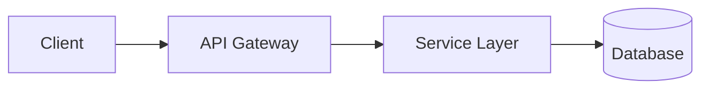

# 문서 생성 형식 가이드

신규 프로젝트 분석 결과를 **3개 산출물**로 출력합니다. 분석에서 발견되지 않은 섹션은 통째로 생략하세요. 빈 섹션 금지.

산출물 구조:
```
프로젝트 루트/
├── CLAUDE.md            # AI 빠른 참조, 자동 로드, ≤200줄
├── bot/
│   ├── INDEX.md         # AI 라우팅 진입점
│   └── *.md (1~5개)     # 사실 카탈로그 (정보량에 따라 분할)
└── human/
    └── README.md        # 사람 진입점, 3단 구조 + mermaid
```

---

## 1. CLAUDE.md (자동 로드 — 최우선)

**대상**: Claude Code (자동 로드되는 프로젝트 지침)
**분량**: **200줄 이내 엄수**
**위치**: 프로젝트 루트
**원칙**: "Claude 가 이 프로젝트에서 실수하지 않기 위해 반드시 알아야 할 것만"

### 포함 항목 (우선순위 순)
1. 빌드/테스트/실행 명령어 (복사해 바로 실행 가능)
2. 프로젝트 구조 요약 (3~5줄)
3. 코딩 컨벤션 (이 프로젝트만의 구체적 규칙)
4. 네이밍 규칙
5. 에러 처리 패턴
6. 테스트 작성 규칙
7. 자주 쓰는 유틸/헬퍼 ("새로 만들지 말 것")
8. 금지 사항
9. 브랜치/커밋 규칙
10. 참조 안내: `@bot/INDEX.md` (AI 깊은 참조), `@human/README.md` (사람 배경)

### 제외 항목
- Claude 가 코드를 읽으면 알 수 있는 내용
- 상세 설명·튜토리얼·아키텍처 장황한 설명
- 자명한 규칙 ("클린 코드 작성")
- 자주 변하는 정보

### 예시

```markdown
# [프로젝트명]

[프로젝트 한 줄 설명]

## 빌드 & 실행
- 빌드: `[명령]`
- 테스트: `[명령]`
- 로컬 실행: `[명령]`

## 프로젝트 구조 (요약)
- [디렉터리]/ → [역할]

## 코딩 컨벤션
- [구체 규칙]

## 에러 처리
- [표준 패턴]

## 자주 쓰는 유틸
- `[유틸명]` ([경로]) — [용도]

## 금지 사항
- [구체 금지]

## 참조
- AI 깊은 참조: @bot/INDEX.md
- 사람 배경 설명: @human/README.md
```

---

## 2. bot/INDEX.md + bot/*.md (AI 사실 카탈로그)

**대상**: Claude Code 가 grep + 부분 read 로 빠르게 인덱싱
**위치**: 프로젝트 루트의 `bot/` 디렉터리
**호환**: `/dualize-docs` 스킬의 bot/ 출력 형식과 동일 — 누적되면 dualize-docs 가 같은 디렉터리에 보강 가능

### bot/INDEX.md (라우팅 진입점)

```markdown
# bot/ — AI 에이전트 진입점

> 이 디렉터리는 /on-boarding 스킬로 YYYY-MM-DD 생성.
> 사람용 배경·다이어그램은 ../human/README.md, 자동 로드 빠른 참조는 ../CLAUDE.md 참조.
> 누적된 문서가 쌓이면 /dualize-docs 로 이 디렉터리 보강 가능.

## 라우팅

| 파일 | 내용 | 갱신 |
|------|------|------|
| [architecture.md](./architecture.md) | 모듈 구조·요청 흐름·진입점 | YYYY-MM-DD |
| [domain-model.md](./domain-model.md) | 핵심 엔티티·관계·DB 스키마 | YYYY-MM-DD |
| ... (1~5개 분할) | ... | ... |
```

### bot/*.md (사실 카탈로그 분할)

**파일 분할 가이드** (정보량에 따라 자연스럽게):
- 작은 프로젝트: 1~3개
- 큰 프로젝트: 3~5개
- 강제 개수 없음. 같은 주제 두 파일 분할(과분할) / 다른 주제 한 파일(혼합) 둘 다 금지

**분할 후보 카테고리** (해당 시):
- `architecture.md` — 모듈 구조, 요청 흐름, 진입점
- `domain-model.md` — 핵심 엔티티, 관계, DB 스키마
- `api-contract.md` — 주요 API, 인증/인가
- `infrastructure.md` — 외부 연동, 배포, 환경 설정
- `rules.md` — 컨벤션, 금지 사항, 코딩 규칙
- `known-issues.md` — 알려진 이슈, 트러블슈팅 (분석에서 발견된 것만)

**파일 형식 (각 파일 공통)**:
- **150줄 이내 권장**, 200줄 경고
- frontmatter 필수:
  ```yaml
  ---
  title: 주제 제목
  type: architecture | domain | api | infra | rules | known-issues | catalog
  last-updated: YYYY-MM-DD
  source-files: [.claude/tmp/onboarding/01-detect.md, ...]
  ---
  ```
- 첫 줄: `> 진입점: [INDEX.md](./INDEX.md)`
- 우선순위: **표 > 불릿 > 서술**
- 코드 레퍼런스: `경로/파일.확장자:줄번호` **완전 경로** (`...` 축약 금지)
- 중복 금지: 같은 사실이 두 파일에 등장하면 한쪽 통합 + 반대쪽 링크

### 예시 (bot/architecture.md)

```markdown
---
title: 아키텍처
type: architecture
last-updated: YYYY-MM-DD
source-files: [.claude/tmp/onboarding/01-detect.md, .claude/tmp/onboarding/03-structure.md]
---

> 진입점: [INDEX.md](./INDEX.md)

## 모듈 구조

| 모듈 | 패키지 | 역할 |
|------|--------|------|
| ... | ... | ... |

## 요청 흐름

| 단계 | 클래스 | 위치 |
|------|--------|------|
| 1. 진입 | OrderController | src/controller/OrderController.java:45 |
| 2. 검증 | OrderValidator | src/service/OrderValidator.java:23 |
| ... | ... | ... |
```

---

## 3. human/README.md (사람 진입점)

**대상**: 사람 (새로 합류하는 개발자, 코드 리뷰어)
**위치**: 프로젝트 루트의 `human/` 디렉터리
**원칙**: "왜" 를 담는다. "무엇" 은 bot/, "그래서 어떻게" 는 결정이 모이면 추가 파일

**3단 구조 강제**:

```markdown
# [프로젝트명]

> 이 디렉터리는 "왜"를 담습니다. "무엇"은 [../bot/INDEX.md](../bot/INDEX.md), 자동 로드 지침은 [../CLAUDE.md](../CLAUDE.md) 참조.

## 1. 배경
- 이 프로젝트가 왜 존재하는지
- 어떤 비즈니스 문제를 해결하는지
- 누가 사용하는지

## 2. 현재 상태
- 핵심 흐름 요약 (한 문단)
- **Mermaid 다이어그램 1개 이상 필수** (요청 흐름, 모듈 관계, 데이터 흐름 중 하나)



## 3. 남은 질문 · 의사결정
- 분석 중 발견된 미해결 항목
- 도메인 전문가 확인 필요 사항
- 향후 결정해야 할 것

## 더 읽을 거리
- [../bot/INDEX.md](../bot/INDEX.md) — AI 사실 카탈로그
- [../CLAUDE.md](../CLAUDE.md) — AI 자동 로드 빠른 참조
```

**보조 파일 (선택, 정보량 충분할 때만)**:
- `human/architecture.md` — AS-IS vs TO-BE 다이어그램 중심
- `human/decisions.md` — 의사결정 타임라인 스토리라인

분석 단계에서 충분한 자료가 모이지 않으면 README.md 만 생성. 빈 보조 파일 만들지 말 것.

---

## 작성 원칙 (3개 산출물 공통)

1. **인덱싱 가능한 구조 우선** — anchor 명확, frontmatter 정확, 표 헤더 명확. 클로드가 grep + 부분 read 가능해야 함
2. **추측 금지** — `.claude/tmp/onboarding/` 중간 파일에 기록되지 않은 내용은 포함 금지
3. **빈 섹션 금지** — 분석에서 발견되지 않은 섹션은 통째로 생략
4. **플레이스홀더 금지** — `[경로]`, `[모듈명]` 같은 미완성 토큰이 최종 문서에 남으면 안 됨
5. **민감 정보 마스킹** — API 키, 비밀번호는 키 이름만 언급
